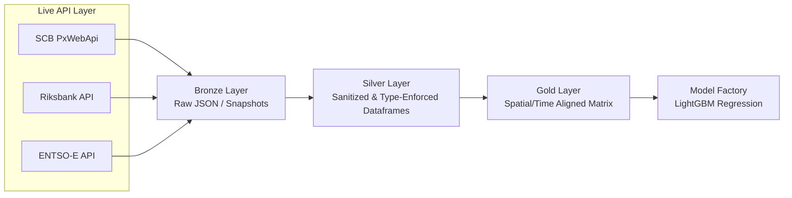

# Sweden Regional Grid Balancing & Structural Load Forecasting Pipeline

An enterprise-grade, event-driven data engineering and machine learning pipeline designed to forecast regional electricity grid imbalance volumes ($MWh$) across Sweden’s four bidding zones (**SE1, SE2, SE3, SE4**). 

The core innovative paradigm of this platform is the structural fusing of high-frequency, short-term grid metrics with low-frequency, long-term macroeconomic and infrastructure vectors (housing development and central bank interest rates) to model the structural transformation of the Swedish electrical grid.

---

## 1. System Architecture Overview
The platform strictly adheres to a decoupled **Medallion Data Architecture** using a unified temporal-spatial alignment matrix to transition unstructured API streams into highly analytical feature sets.



### Data Layer Definitions:
*   **Bronze Layer:** Immutable raw payloads captured directly from upstream REST endpoints, saved as zipped JSON/CSV files with execution timestamps.
*   **Silver Layer:** Schema-validated, type-casted, and timezone-aware dataframes. Character encodings (ISO-8859-1 to UTF-8) are normalized, and Swedish localized strings are sanitized.
*   **Gold Layer:** The finalized Feature Store. Daily macroeconomic and hourly grid parameters are harmonized using specialized forward-fill and interpolation structures, mapping 290+ SCB Municipalities (*Kommuner*) into their respective Nord Pool Bidding Zones.

---

## 2. Core Data Sources & Pipelines

### A. Long-Term Infrastructure: SCB Real Estate Price & Volume Index
*   **Source:** Statistiska centralbyrån (SCB) PxWebApi v2.
*   **Target Tables:** Real estate construction, type, and price index for single- and two-dwelling buildings (*småhus/villor*).
*   **Engineering Challenge:** Normalizing quarterly periodic strings (e.g., `2025K1`, `2026K2`) into standardized UTC timestamps.

### B. Macroeconomic Leading Indicators: Riksbanken Styrränta
*   **Source:** Sveriges Riksbank SWEA REST API.
*   **Target Vector:** Historical Policy Rate (*Styrränta*).
*   **Engineering Challenge:** Asynchronous frequency mapping (rates update dynamically based on monetary policy updates, requiring step-wise forward filling).

### C. High-Frequency Grid Metrics: ENTSO-E & Svenska kraftnät
*   **Source:** ENTSO-E Transparency Platform REST API / Svk Mimer Portal.
*   **Target Vectors:** Actual Total Load ($MW$), Day-Ahead Prices, and Net Grid Imbalance Volumes ($MWh$).
*   **Engineering Challenge:** Multi-frequency alignment (converting hourly grid metrics into regional spatial-temporal structures without introducing temporal data leakage).

---

## 3. Production & Scalability Safeguards

To survive production data environments, the codebase implements four architectural guardrails:

1.  **Strict Schema Enforcement (Pydantic v2):** Upstream API modifications are instantly caught at the boundary of the Ingestion Layer. If a key name changes, the ingest pipeline logs a critical alert and aborts safely.
2.  **API Rate-Limiting & Fault Tolerance:** Implements an exponential backoff retry decorator configured to respect SCB's traffic threshold (max 30 requests / 10 seconds) and ENTSO-E token caps.
3.  **Idempotent Execution Execution Loops:** All ingestion and transformations use date-partitioned targets. Running the pipeline multiple times over the same window updates existing files cleanly without creating duplicate or corrupt records.
4.  **Temporal Leakage Isolation:** High-frequency grid data is strictly split using time-series cross-validation (`TimeSeriesSplit`). Aggregations or interpolations are applied *within* cross-validation folds to prevent future information from bleeding into past training sequences.

---

## 4. Repository Structure

```text
sweden-energy-grid-pipeline/
├── config/
│   ├── settings.yaml              # API Endpoints, parameters, and credentials
│   └── schemas/                   # Pydantic data models for validation
├── data/
│   ├── bronze/                    # Raw immutable JSON/CSV dumps
│   ├── silver/                    # Cleaned, structured Parquet files
│   └── gold/                      # Unified feature store analytical matrices
├── src/
│   ├── __init__.py
│   ├── ingestion/                 # API consumers and client logic
│   │   ├── client.py              # Base HTTP Client with retry/backoff wrappers
│   │   ├── scb_fetcher.py         # SCB PxWebApi v2 Consumer
│   │   └── energy_fetcher.py      # ENTSO-E Grid Data Consumer
│   ├── processing/                # Medallion Silver conversion logic
│   │   ├── encoders.py            # UTF-8 and Swedish character normalizers
│   │   └── silver_alignment.py    # Spatial-temporal mapping engine (Kommun -> Bidding Zone)
│   ├── features/                  # Feature Engineering & Gold generation
│   │   └── feature_store.py       # Rolling averages, lagging features, and load profiles
│   └── models/                    # Model training, inference, and evaluation
│       ├── train.py               # Time-split LightGBM training script
│       └── evaluate.py            # Metrics output (RMSE, MAE) and Shapley plots
├── tests/                         # PyTest suite for pipeline verification
├── requirements.txt               # Dependencies
└── README.md                      # Project documentation
```

## 5. Getting Started
Prerequisites
Python 3.11+

ENTSO-E API Security Token

Installation
Bash
git clone [https://github.com/roycenz/sweden-energy-grid-pipeline.git](https://github.com/roycenz/sweden-energy-grid-pipeline.git)
cd sweden-energy-grid-pipeline
pip install -r requirements.txt
Local Pipeline Verification
To verify the ingestion modules against live mock endpoints, execute:

Bash
python -m src.ingestion.client
